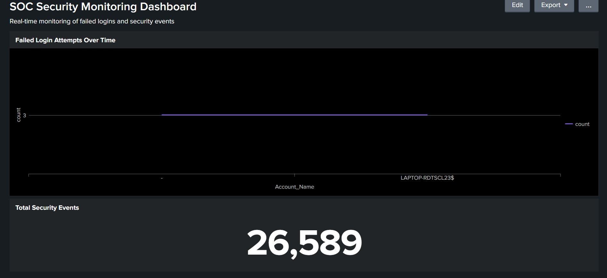
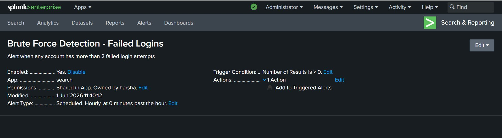
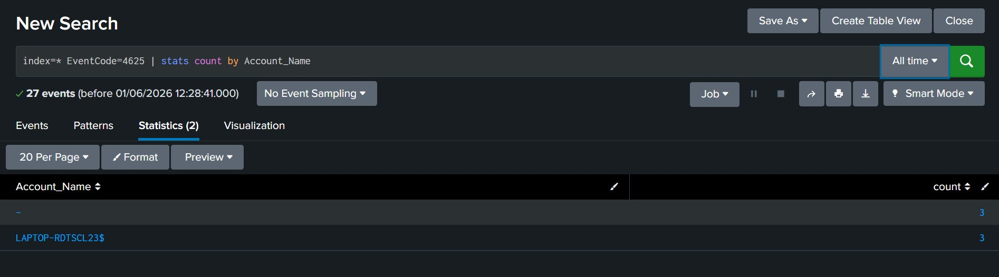

🔵 SIEM Home Lab – Splunk Security Monitoring


📌 Project Overview
A fully functional SIEM (Security Information and Event Management) Home Lab built using Splunk Enterprise on Windows. This project simulates a real-world Security Operations Center (SOC) environment — ingesting live Windows Event Logs, detecting failed login attempts, creating automated alerts, and visualizing security data through a custom SOC dashboard.
---
🎯 Objectives
Deploy and configure Splunk Enterprise as a SIEM platform
Ingest and analyze real Windows Security Event Logs
Detect brute force and failed login attempts using SPL queries
Build automated detection alerts triggered by suspicious activity
Create a SOC monitoring dashboard for real-time visibility
---
🛠️ Tools & Technologies
Tool	Purpose
Splunk Enterprise	SIEM Platform
Windows Event Logs	Log Source (Security, System, Application)
SPL (Splunk Query Language)	Log analysis and threat detection
Splunk Alerts	Automated threat detection
Splunk Dashboards	Security visualization
---
🏗️ Lab Architecture
```
Windows PC
│
└── Splunk Enterprise (localhost:8000)
    │
    ├── Data Input → Windows Event Logs
    │   ├── WinEventLog:Security
    │   ├── WinEventLog:System
    │   └── WinEventLog:Application
    │
    ├── SPL Detection Queries
    │   └── EventCode=4625 (Failed Logins)
    │
    ├── Automated Alerts
    │   └── Brute Force Detection Rule
    │
    └── SOC Dashboard
        ├── Failed Login Attempts Chart
        └── Total Security Events Counter
```
---
📸 Screenshots
🖥️ SOC Security Monitoring Dashboard

> Real-time SOC dashboard showing Failed Login Attempts chart and Total Security Events counter (26,589 events)
---
🚨 Brute Force Detection Alert

> Automated hourly alert configured to trigger when failed login attempts exceed threshold — owned by harsha, enabled and active
---
🔍 SPL Search Results — Failed Login Investigation

> SPL query results showing 27 failed login events (EventCode=4625) grouped by Account_Name
---
📋 Implementation Steps
Step 1 — Install Splunk Enterprise
Downloaded Splunk Enterprise (free trial) from splunk.com
Installed on Windows using `.msi` installer
Configured admin credentials and launched Splunk Web at `localhost:8000`
Step 2 — Configure Log Ingestion
Navigated to Settings → Add Data → Monitor → Local Event Logs
Enabled ingestion for Security, System, and Application logs
Verified 107,000+ events successfully indexed
Step 3 — Threat Detection with SPL
Search for Failed Login Attempts (Brute Force Indicator):
```spl
index=* EventCode=4625 | stats count by Account_Name
```
Identify accounts with multiple failures:
```spl
index=* EventCode=4625 | stats count by Account_Name | where count > 2
```
Timeline analysis of failed logins:
```spl
index=* EventCode=4625 | timechart span=1d count by Account_Name
```
Step 4 — Create Automated Alert
Saved detection query as a Scheduled Alert (runs hourly)
Trigger condition: Number of results > 0
Severity: High
Action: Add to Triggered Alerts
Alert Name: Brute Force Detection - Failed Logins
Step 5 — Build SOC Dashboard
Created SOC Security Monitoring Dashboard with:
Panel 1: Failed Login Attempts by Account (Line Chart)
Panel 2: Total Security Events Count (26,589)
---
📊 Key Findings
Event Code	Description	Count Detected
4625	Failed Login Attempts	27 events
4798	User Account Activity	Multiple
All Security Events	Total ingested	26,589+
Accounts flagged:
Account Name	Failed Logins	Verdict
`LAPTOP-RDTSCL23$`	3	Machine account — normal behavior
`(blank)`	3	Anonymous/system process — normal
Conclusion: No active external brute force attack detected. Events identified as normal Windows background authentication processes.
---
🔍 SOC Analyst Skills Demonstrated
✅ SIEM deployment and configuration
✅ Log ingestion and indexing
✅ Windows Event Log analysis
✅ SPL (Splunk Query Language) proficiency
✅ Threat detection rule creation
✅ Alert configuration and tuning
✅ Dashboard building and data visualization
✅ Incident investigation and documentation
✅ MITRE ATT&CK alignment (T1110 — Brute Force)
---
🚀 How to Replicate This Lab
Download Splunk Enterprise (free 60-day trial) from splunk.com
Install on Windows and launch at `http://localhost:8000`
Go to Add Data → Monitor → Local Event Logs
Enable Security, System, and Application logs
Use the SPL queries above to detect threats
Create alerts and dashboards as documented
---
👤 Author
Harsha
🎓 B.Tech CSE Graduate — Aditya College of Engineering and Technology
🏆 Certified Ethical Hacker (CEH) — EC-Council, 2024
🔐 Cybersecurity Intern — Y Hills (March–May 2025)
🎯 Target Role: SOC Analyst | Security Operations
---
📜 Certifications
CEH — EC-Council (2024)
Cybersecurity Certification — Y Hills (2025)
AI Certification — Skill Dzire (2024)
---
> *This project was built as part of a personal cybersecurity portfolio to demonstrate hands-on SOC analyst skills using industry-standard tools.*
